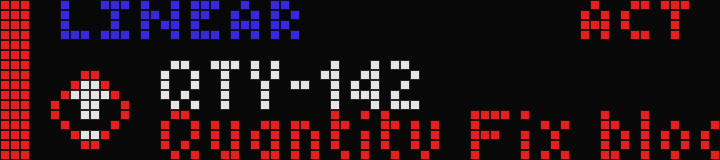
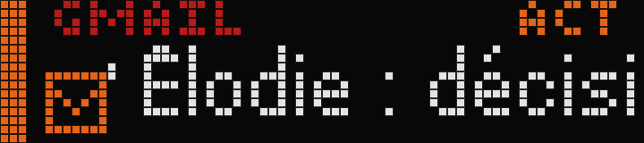
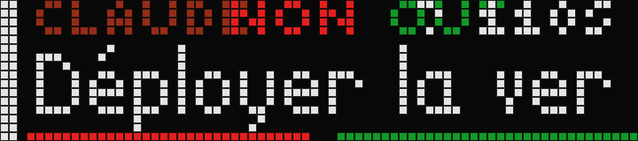
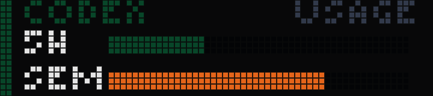

<p align="center">
  
</p>

<h1 align="center">FounderOS for BUSY Bar</h1>

<p align="center">
  An open source decision engine that selects the one thing a founder should see now.<br>
  Built and tested against a faithful local emulator of the Flipper <code>BUSY Bar</code>.
</p>

<p align="center">
  <a href="#founderos">FounderOS</a> &middot; <a href="#quick-start">Quick start</a> &middot; <a href="docs/founderos/ARCHITECTURE.md">Architecture</a> &middot; <a href="#the-api">API</a> &middot; <a href="docs/ATTRIBUTION.md">Attribution</a>
</p>

<p align="center">
  
  
  
  
  
</p>

<p align="center">
  
</p>

---

> [!IMPORTANT]
> **Unofficial community project.** Built and maintained by [Max Swinkels](https://github.com/maxswinkels), **not** an official Flipper Devices / BUSY product, and not affiliated with, endorsed by, or supported by them. "BUSY Bar" remains their trademark. For the real hardware and official apps, visit **[busy.app](https://busy.app)**.

## Why

- **One screen, one decision.** FounderOS continuously chooses the single event that deserves 72×16 pixels.
- **Deterministic by default.** The normal loop uses explicit scores and persistent memory, with no model call.
- **Connectors cannot seize the display.** Every source emits the same event contract and only the priority engine can select output.
- **The hardware isn't here yet.** The BUSY Bar sells out fast, so this lets you build and test apps right now instead of waiting.
- **BUSY Bar apps are just HTTP calls.** Apps target the device's REST API; the emulator implements that same API, so an app you build here runs unchanged on the real hardware. Just swap the host.
- **Hardware behavior is governed.** The API surface and observed firmware quirks are pinned as executable conformance tests. Physical-device acceptance remains an explicit release gate.

## Quick start

```bash
git clone https://github.com/maxswinkels/busybar-emulator.git
cd busybar-emulator
npm ci
npm ci --prefix web
npm run build
npm start
# → http://127.0.0.1:8080
```

Then drive it like the real device:

```bash
python3 apps/clock.py              # big clock in the real device font
python3 apps/busy_status.py coding # plays the real "coding" theme animation
python3 apps/weather.py            # uploads an icon asset + draws a temperature
python3 apps/sound_test.py         # plays every stock sound in order (emulator lists them automatically)
python3 apps/pixel_fire.py         # demoscene fire on the LEDs (also: rain, plasma)
python3 apps/mac_monitor.py        # CPU / RAM / network bars from your Mac
```

## FounderOS

FounderOS turns the BUSY Bar into a decision peripheral. Connectors never draw to the screen. They emit normalized events, then a deterministic engine selects the single event that deserves the 72×16 display.

Run the credential-free gallery scenario in a second terminal:

```bash
python3 apps/founderos.py --demo
```

Or open the emulator's **Apps** tab, choose `founderos`, add `--demo`, and run it there. The default mixed scenario proves that a Linear blocker outranks a Slack mention, an unread email, and an upcoming calendar event.

FounderOS includes:

- deterministic, explainable ranking with persistent deduplication memory;
- a persistent, audited obligation ledger with owners, next actors, due dates, gates, evidence, and relationship memory;
- Linear, Slack, Gmail, Google Calendar, LinkedIn bridge, Claude, ChatGPT/Codex, Notion, Drive, Sheets, GitHub, deployment, Sentry, PostHog, Shopify, Superhuman reminder, Stripe, and Home Assistant connectors;
- governed Linear portfolio scope with bounded pagination and project-risk rollups;
- deterministic Gmail incoming-action and outgoing-promise classification, bounded Slack thread signals, and Calendar before/after meeting transitions;
- a governed multi-source presence output that combines Calendar with expiring focus, call, and recording leases, then publishes one state through the BUSY Bar Matter switch without blocking the 72x16 display;
- operational false-ready gates, scoped evidence quorum, capacity and handoff checks, burst compaction, and source-priority normalization;
- a local-only emulator Obligations tab plus audited CLI corrections for state, owner, next action, delegation, gates, evidence, and relationship cooling;
- additional production connectors disabled by default until their narrow credentials and entity mappings are configured;
- zero LLM calls in the normal loop;
- an optional OpenAI Responses API fallback only for close ties;
- a governed six-state animated icon language for waiting, blocked, decision, meeting, validation, and success;
- live Codex quota bars through the official local app-server interface;
- request-bound Claude and Codex permission decisions with a 45-second fail-safe timeout;
- layouts constrained and tested against the exact BUSY Bar HTTP draw contract;
- concurrent source health, direct API connectors, durable Linear and Google OAuth refresh, and a governed snapshot bridge for authorized connector data;
- native macOS Keychain storage plus supervised FounderOS and loopback-only emulator LaunchAgents.

```bash
# Inspect the decision and frame without touching the display
python3 apps/founderos.py --demo --dry-run --once --explain --frame-json

# Run the complete test suite
npm test
```

See [FounderOS architecture](docs/founderos/ARCHITECTURE.md), [configuration](docs/founderos/CONFIGURATION.md), the [Stream Deck setup](docs/founderos/STREAM-DECK-SETUP.md), and the [gallery capture checklist](docs/founderos/GALLERY.md).

### Governed obligations

When `closure.enabled` is true, raw connector events are first reconciled into durable obligations. Only governed obligation events and runtime health or permission events enter normal ranking. The emulator's **Obligations** tab reads the private snapshot through a localhost-only endpoint.

```bash
python3 apps/founderosctl.py --config founderos.autonomous.local.json obligation list
python3 apps/founderosctl.py --config founderos.autonomous.local.json obligation show OBLIGATION_ID
python3 apps/founderosctl.py --config founderos.autonomous.local.json obligation action OBLIGATION_ID "Send the validated proposal" --actor Yann
python3 apps/founderosctl.py --config founderos.autonomous.local.json obligation delegate OBLIGATION_ID Sam
python3 apps/founderosctl.py --config founderos.autonomous.local.json relationship show partner.example
```

See the [founder workflow closure program](docs/founderos/WORKFLOW-ROADMAP.md) for the shipped controls and the remaining deployment-specific activation gates.

### Governed presence indicator through Matter

FounderOS combines Google Calendar with authenticated, expiring `focus`, `manual_call`, and `recording` leases. The fixed priority is `recording > meeting > manual_call > focus > available`. A Matter controller such as Apple Home, Google Home, or Home Assistant maps busy switch `ON` to a red Hue office light and `OFF` to the light being off. `focus` remains a local state and does not turn the red indicator on. This does not start a BUSY timer, so FounderOS retains the 72x16 canvas.

Home Assistant is optional. If the BUSY Bar and Hue light are already available in Apple Home, two Apple Home automations are sufficient. See the [Matter indicator setup](docs/founderos/CONFIGURATION.md#multi-source-presence-indicator-through-busy-bar-matter).

### Autonomous macOS service

The tracked `founderos.macos.example.json` contains no credentials. Copy it to an ignored local file, replace the workspace and channel placeholders, authorize the read-only providers, then install the supervised service:

```bash
cp founderos.macos.example.json founderos.autonomous.local.json

# OAuth setup. Google requires a downloaded Desktop app client JSON.
python3 apps/founderosctl.py --config founderos.autonomous.local.json auth linear --client-id YOUR_LINEAR_CLIENT_ID
python3 apps/founderosctl.py --config founderos.autonomous.local.json auth google --client-json ~/Downloads/client_secret.json

# Copy the Slack bot token, then import it without placing it in shell history.
python3 apps/founderosctl.py --config founderos.autonomous.local.json secret import-clipboard SLACK_BOT_TOKEN

# This preflight must report every enabled connector as healthy.
python3 apps/founderos.py --config founderos.autonomous.local.json --once --dry-run --require-healthy

# Install locked dependencies, build the emulator UI, and supervise both processes.
npm ci
npm ci --prefix web
npm run build
python3 apps/founderosctl.py --config founderos.autonomous.local.json service install
python3 apps/founderosctl.py --config founderos.autonomous.local.json service status
```

Secrets stay in the macOS Keychain. They are never written to the plist, configuration, process arguments, heartbeat, or logs. When signed local interaction is enabled and its allowlisted Keychain entry is absent, `service install` generates the bridge secret directly in the Keychain without printing it. The emulator listens on `127.0.0.1` by default and keeps its private state outside the checkout. Installation succeeds only after the new FounderOS process publishes a heartbeat with the same PID reported by launchd, a healthy display, and healthy connectors. Use `service install --skip-emulator` when the configured display is physical hardware. Full provisioning and recovery details are in [configuration](docs/founderos/CONFIGURATION.md#autonomous-macos-deployment).

The project-local Claude and Codex hooks are already tracked. Enable both agent connectors in your local configuration, then run FounderOS:

```bash
python3 apps/founderos.py --config founderos.local.json
```

Emulator SSE is intentionally untrusted and cannot approve anything. Production input is bound to the exact selected event and request. Same-account desktop clients use a private Unix socket without copying the signing secret, while other local adapters use the loopback HMAC bridge in `apps/founderos_input.py`. Codex users must review the project hook with `/hooks` before its first use. See [Claude and ChatGPT/Codex configuration](docs/founderos/CONFIGURATION.md#claude-and-chatgptcodex) and the [production closure register](docs/founderos/PRODUCTION-CLOSURE.md).

The prioritized product direction based on real founder workflows is documented in the [workflow roadmap](docs/founderos/WORKFLOW-ROADMAP.md).
The hardware behavior observed through BarPilot is pinned and governed in the [BarPilot compatibility profile](docs/founderos/BARPILOT-COMPATIBILITY.md).

<p align="center">
  
</p>

<p align="center">
  
  <br>
  
</p>

> [!TIP]
> Take any real BUSY Bar example script, point its host at `127.0.0.1:8080`, and it just works. The API is identical, right down to accepting `app_id`.

## Share your apps

Built something cool? Share it in the [community gallery](https://maxswinkels.github.io/busybar-apps/). Browse what others made, or submit your own via pull request to [busybar-apps](https://github.com/maxswinkels/busybar-apps).

## Features

- **Firmware-faithful HTTP API**: exact paths, verbs, response shapes and error codes (incl. 409 priority conflicts and `X-API-Token` auth), api_semver 25.0.0
- **Differential canvas updates**: same-application draws merge by element `id`, so animated icons do not restart scrolling task text
- **Raw screen readback**: `/api/screen` returns the firmware-compatible 72×16 BGR front buffer and 80×80 grayscale back buffer, including uploaded PNG, JPEG, GIF, WebP and SVG assets, stock icons, and stock animations
- **Pixel-perfect text**: the device's real TTF fonts, baked to a 1-bpp glyph atlas with `lv_font_conv` using the firmware's own parameters
- **Real 72×16 animations**: all 12 status themes plus effects, imported straight from the firmware
- **Complete stock icon set**: 66 draw-tool icons, referenced exactly like the device (`faces/emoji-grinning`, `sun`, `heart`, …)
- **Authentic LED look**: square pixels, front-panel gamma (0.35) and a grayscale back OLED
- **WYSIWYG draw tool**: place text, rectangles and icons on the 72×16 grid with the device's exact fonts, pushed live to the bar
- **Web UI ported from the device**: Vue 3 frontend with the BUSY logo, device illustration and the Network / Firmware / Settings / Draw tabs

## Draw tool

Edit text, rectangles and stock icons right on the 72×16 canvas, with the same fonts and pixels as the device screen, pushed live to the bar in real time.

## Capture

The display panel has two export buttons that produce the files busybar-apps expects in an app folder:

- **PNG** saves `preview.png` at 720×160 (72×16 LEDs × 10 px) in one click.
- **GIF** records `preview.gif` at 20 fps for up to 30 s. Click once to start, then again to stop and download. Encoding is client-side (no server involved).

## The API

Success responses are `{"result":"OK"}` and errors are `{"error","code"}`. Auth mirrors the device: `X-API-Token` is only enforced for non-localhost callers when `BUSY_API_TOKEN` is set. Localhost is always allowed.

```bash
curl -s -X POST localhost:8080/api/display/draw -H 'content-type: application/json' -d '{
  "application_name":"cli","priority":50,
  "elements":[{"id":"t","type":"text","text":"HELLO","x":36,"y":8,
               "font":"extra_large","align":"center","color":"0x2B7FFFFF"}]}'
```

<details>
<summary>Endpoints &amp; element schema</summary>

| Method &amp; path | Purpose |
|---|---|
| `POST /api/display/draw` | Draw a frame: `{application_name, priority(1–100), elements[]}` → 409 if priority too low |
| `DELETE /api/display/draw?application_name=` | Clear (omit query to clear all) |
| `GET /api/screen?display=0\|1` | Base64 raw framebuffer, front BGR888 or back gray8 |
| `GET/POST /api/display/brightness?value=auto\|0-100` | Single brightness value |
| `POST /api/audio/play` · `DELETE /api/audio/play` · `GET/POST /api/audio/volume?volume=` | Sound |
| `POST /api/assets/upload?application_name=&file=` · `DELETE …` | PNG assets |
| `POST/GET/DELETE /api/storage/{write,read,list,mkdir,remove,rename,status}?path=` | Key/value store |
| `GET/PUT /api/busy/snapshot` · `GET/PUT /api/busy/profiles/{busy\|custom}` | BUSY timer/status |
| `GET/POST /api/name` · `GET /api/time` · `/api/time/{timestamp,timezone,tzlist}` | Device name / clock |
| `GET /api/status[/{device,firmware,system,power}]` | Nested status, `uptime` as a string |
| `WS /api/status/ws` | Status stream, enabled with `{"enable":true}` |
| `GET /api/version` → `{"api_semver":"25.0.0"}` · `GET /api/transport` · `GET/POST /api/access` | Meta |
| `POST /api/input?key=` · `POST /api/log_dump` | Buttons / logs |
| `GET /api/_animations` | *(emulator)* imported-animation manifest with `fps`/`sections` |
| `GET /api/_sounds` | *(emulator)* stock-sound manifest `{name: filename}` (used by `sound_test.py`) |
| `GET /api/_apps` | *(emulator)* list runnable example apps + current app state/output |
| `GET /api/_founderos/obligations` | *(emulator, localhost only)* current private closure snapshot for the Obligations tab |
| `POST /api/_apps/start` | *(emulator)* `{name, args?}`, spawn an app (stops any running app first); foldered `apps/local` apps with a `requirements.txt` run in an auto-created per-app `.venv` |
| `POST /api/_apps/stop` | *(emulator)* stop the running app → `{stopped:bool}` |
| `GET /api/_scenario` | *(emulator)* scenario state: power override, offline window, steal ownership |
| `POST /api/_scenario/power` | *(emulator)* `{battery_charge?, state?}` set battery % / charging state (shown in `/api/status/power`) |
| `POST /api/_scenario/offline` | *(emulator)* `{duration_ms}` reset all non-emulator `/api/*` connections for the window; call again to restore early |
| `POST /api/_scenario/steal` | *(emulator)* `{priority?=99, duration_ms?}` draw a high-priority frame so lower-priority draws get 409 |
| `POST /api/_scenario/blocker` | *(emulator)* `{type:menu\|physical_busy\|smart_home, active}` reproduce firmware canvas blockers |
| `POST /api/_scenario/reset` | *(emulator)* clear all scenario overrides |

```jsonc
// text: colour 0xRRGGBBAA (default 0xFFFFFFFF)
{ "id":"a","type":"text","text":"BUSY","x":36,"y":8,"align":"center",
  "font":"tiny|small|normal|condensed|bold|large|extra_large|global",
  "width":62,"scroll_rate":600,"scroll_start_delay":500,"scroll_repeat_delay":1000 }

// image: path (uploaded) OR stock_path ('faces/emoji-grinning', or sun|cloud|heart|check|bolt)
{ "id":"b","type":"image","x":1,"y":0,"stock_path":"faces/emoji-grinning","opacity":100 }

// animation: a device animation folder name
{ "id":"c","type":"animation","stock_path":"coding_72x16","x":0,"y":0,"section":"default","loop":true }

// rectangle: fill none|solid|gradient_h|gradient_v
{ "id":"d","type":"rectangle","x":56,"y":9,"width":15,"height":6,
  "border_width":1,"border_color":"0xFFB000FF","fill":"gradient_h","fill_colors":["0xFF3C3CFF","0x2B7FFFFF"] }
```

Common fields: `id` (required), `type` (required), `x`, `y`, `align` (`top_left` … `center` … `bottom_right`), `timeout` (seconds), `display_until` (unix epoch), `display` (`front`/`back`).

</details>

## Point it at real hardware

```python
bar = BusyBar("10.0.4.20")   # USB-ethernet or the bar's Wi-Fi IP
```

Same fonts, alignment, colors, scrolling, stock icons, timeouts, priority and asset uploads. It all follows the device's HTTP API.

## Architecture

```
┌── apps (Python) ──┐   POST /api/display/draw    ┌── server.js (Node) ──┐   SSE   ┌── browser ──┐
│ clock, weather,   │  ─────────────────────────▶ │ mock BUSY Bar API +  │ ──────▶ │ LED display │
│ ping, deploy …    │                             │ device state         │         │ (renderer)  │
└───────────────────┘                             └──────────────────────┘         └─────────────┘
```

`web/` is a Vite/Vue 3 frontend, built to `web/dist` and served by `server.js`. `tools/` holds the font-atlas bake process (see `tools/README.md`).

<details>
<summary>Fidelity notes</summary>

- **Rendering is a faithful approximation.** Assets decode in the browser (1 image pixel = 1 LED), the front display applies gamma 0.35, and the back OLED is grayscale. `busy_tiny` is bitmap-only and falls back to `busy_regular_5px`.
- **Priority, merge, expiry, and 409 behavior match the observed firmware contract.** The current owner may redraw at equal priority, same-application elements merge by `id`, element leases expire independently, and a different app needs strictly higher priority. Timer, hidden physical-session, device-menu, and smart-home blockers are available as scenarios. The real device may additionally defer a conflicting request for up to 1.5 seconds.
- **Complete BarPilot API 25 surface.** All 53 unique BarPilot paths and all 69 HTTP operations have explicit, stateful or safely emulated behavior. The status WebSocket is covered separately. The executable matrix lives in `tests/fixtures/barpilot-api25-contract.json`.
- **Safe emulation boundary.** Firmware installation, cloud account linking, Matter pairing, Wi-Fi, and BLE change emulator state only. They never mutate the host network, account, radio, or firmware. `/api/_animations`, `/api/_apps*`, and `/api/_scenario*` remain emulator conveniences.

</details>

## Roadmap

The goal is the fastest way to build, test and show off BUSY Bar apps, with or without hardware.

**Playground &amp; testing**

- [ ] **API console**: a request builder for every `/api/*` endpoint, with live responses and replay (the draw tool, generalized)
- [x] **Scenario simulator**: trigger the conditions apps must handle, like low battery, USB/Wi-Fi drop, button presses, and a higher-priority app stealing the screen (so you can test your 409 handling)
- [ ] **Multi-app sandbox**: run several apps at once and watch priority decide who owns the screen
- [ ] **Record &amp; replay**: capture an app's calls and scrub the timeline to debug animation timing

**Fidelity**

- [x] **Screen stream (`/api/screen`)**: serve firmware-compatible front and back raw framebuffers so third-party tools can target the emulator
- [x] **Back OLED framebuffer (80×80)**: render `display:"back"` elements in grayscale readback
- [x] **Audio playback**: play stock and uploaded sounds, with a beep fallback

**SDK &amp; distribution**

- [ ] **Published clients**: the Python client on PyPI and a TypeScript client on npm, mirroring the official libraries
- [ ] **`npx busybar-emulator`**: run with no build step, plus a Docker image
- [ ] **App templates**: `create-busybar-app` starters (clock, status, monitor)
- [x] **Persistent state**: storage and uploaded assets survive restarts

**Content creation**

- [ ] **Animation editor**: build and export frame-by-frame 72×16 animations in the device format
- [x] **Copy as code**: export any draw-tool composition as a ready-to-paste `draw` payload (Python / curl / JSON)
- [ ] **Status gallery**: save, browse and re-push compositions like the device does

## Get the real thing

This is only an emulator. The BUSY Bar itself is a lovely piece of hardware built by [Flipper Devices](https://busy.app). If this project is useful to you, support the makers and grab one:

<a href="https://busy.app"><strong>busy.app →</strong></a>

## License

Code is [MIT](LICENSE). Bundled fonts, animations, icons and device artwork are © Flipper Devices, from the open-source [firmware](https://github.com/busy-app/busybar-firmware) under CC-BY 4.0 (graphics) and SIL OFL 1.1 (fonts). See [docs/ATTRIBUTION.md](docs/ATTRIBUTION.md) for the details.

"BUSY Bar" is a trademark of Flipper Devices. This project is unaffiliated and unofficial.

## Author

**Max Swinkels**
